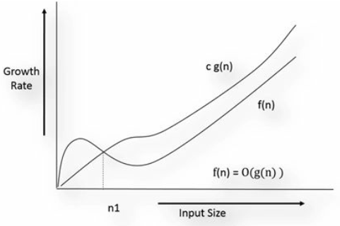

# Big-O Notation

Definition: “f(n) is big-O of g(n)” or f(n) = O(g(n)), if there are two +ve constants c and n0 such that

f(n) ≤ c g(n) for all n ≥ n0,

In other words, c g(n) is an upper bound for f(n) for all n ≥ n0 The function f(n) growth is slower than c g(n)

We can simply say that after a sufficient large value of input N the (c.g(n)) will always be greater than f(n).

Example: $n^2 + n = O(n^2)$

