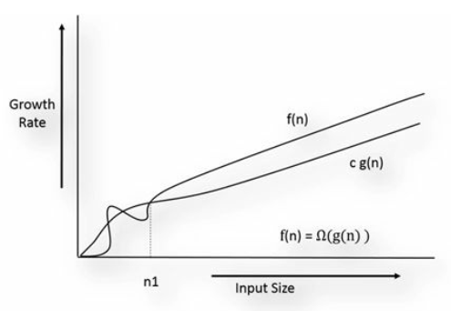

# Omega-Ω Notation
Definition: “f(n) is omega of g(n).” or f(n) = Ω(g(n)) if there are two +ve constants c and n0 such that

c g(n) ≤ f(n) for all n ≥ n0

In other words, c g(n) is lower bound for f(n)

Function f(n) growth is faster than c g(n)

Find relationship of $f(n) = n^c$ and $g(n) = c^n​$

`f(n) = Ω(g(n))`